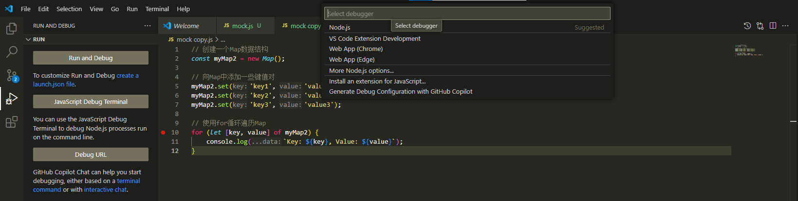
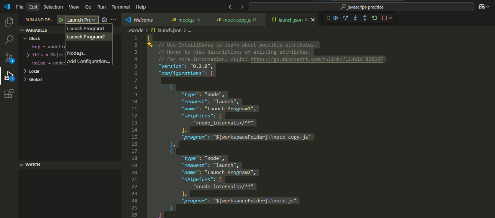
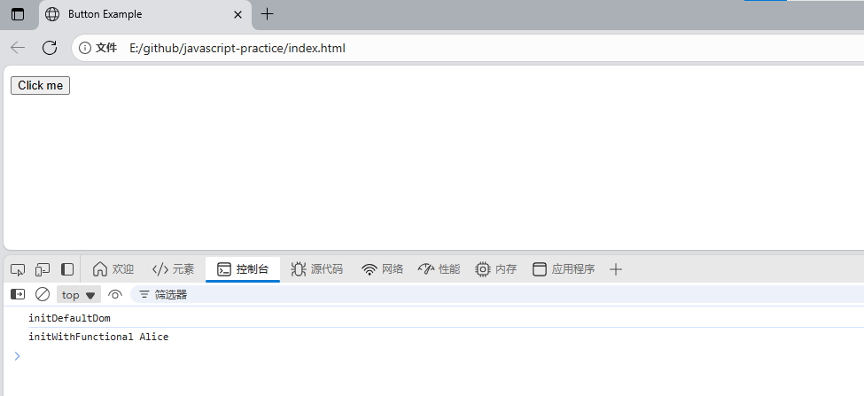

# javascript-practice


vscode原生支持JavaScript,只需安装node环境即可

```shell
E:\github\javascript-practice>node -v
v18.17.1

E:\github\javascript-practice>npm -v
10.9.0
```
## 调试Javascript程序:
F5打开调试, 选择Node模式



之后vscode会帮我们创建launch.json文件, 项目结构如下

```shell
E:\github\javascript-practice>tree /f
Folder PATH listing for volume 新加卷
Volume serial number is 1E87-7BD0
E:.
│   .gitignore
│   mock copy.js
│   mock.js
│   README.md
│
└───.vscode
        launch.json
```
### 调试指定JavaScript文件
如果你想指定调试某一个js文件, 则需要新建属于当前vscode工程的launch.js文件

- "type": "node",
- "request": "launch",
- "name": "Launch Program1",
- "program": "${workspaceFolder}\\指定.js"

如下配置写两组,分别是Launch Program1和Launch Program2

```json
{
    // Use IntelliSense to learn about possible attributes.
    // Hover to view descriptions of existing attributes.
    // For more information, visit: https://go.microsoft.com/fwlink/?linkid=830387
    "version": "0.2.0",
    "configurations": [
  
        {
            "type": "node",
            "request": "launch",
            "name": "Launch Program1",
            "skipFiles": [
                "<node_internals>/**"
            ],
            "program": "${workspaceFolder}\\mock copy.js"
        },
        {
            "type": "node",
            "request": "launch",
            "name": "Launch Program2",
            "skipFiles": [
                "<node_internals>/**"
            ],
            "program": "${workspaceFolder}\\mock.js"
        }
    ]
}
```

效果如下,选择指定的debug配置即可生效



### 调试当前JavaScript文件

一个一个去指定文件太麻烦了, 如何随时随地调试当前打开的文件呢?

launch.js使用vscode内置的变量${file}
```JavaScript
{
    "version": "0.2.0",
    "configurations": [
        {
            "type": "node",
            "request": "launch",
            "name": "Launch Current File",
            "skipFiles": [
                "<node_internals>/**"
            ],
            "program": "${file}"
        }
    ]
}
```

## 调试HTML
launch.json 不能直接运行 HTML 文件，只能运行 JS/Node 程序。

为了让vscode识别到入口html, 需要创建 tasks.json 启动浏览器, 比如
```json
{
  "version": "2.0.0",
  "tasks": [
    {
      "label": "Open index.html",
      "type": "shell",
      "command": "start index.html",
      "group": "build",
      "presentation": {
        "reveal": "always"
      }
    }
  ]
}
```

然后, 你需要将index.html放在项目根目录, 像这样
```html
<!DOCTYPE html>
<html>
  <head>
    <title>Button Example</title>
  </head>
  <body>
    <button id="myBtn">Click me</button>
    <script src="src/scopethis/domfunction.js"></script>
  </body>
</html>
```

现在 ,ctrl +shift +p, 输入Run Task, 选择Open index.html(你在task.json中定义的lable), 成功打开浏览器


> 还有一个方式是安装插件 live server, 一键运行html, 无需配置, 但显得不够专业, 个人不喜欢